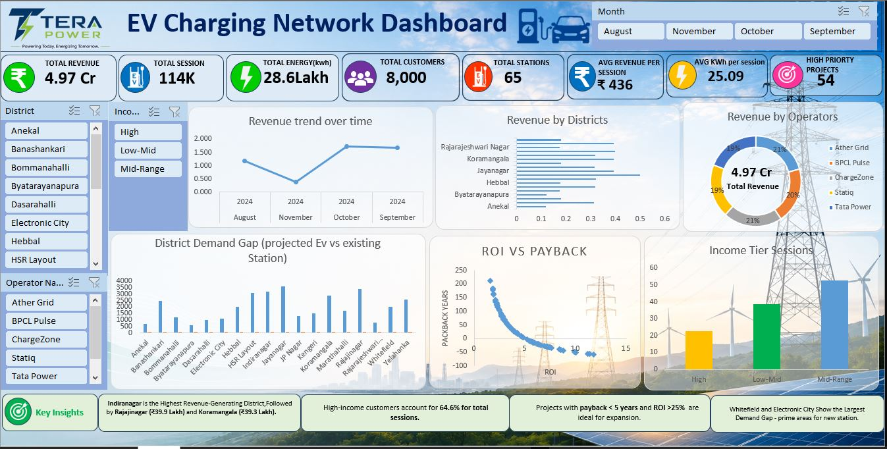

# ⚡ EV Charging Network Dashboard | Tera Power Infrastructure Expansion Analysis

## 📊 Dashboard Preview

---

## 📌 Project Overview

This project presents an interactive excel dashboard designed to analyze EV charging station performance, customer charging behavior, district-wise demand, and financial feasibility of charging infrastructure expansion across Bengaluru.

The dashboard helps stakeholders identify high-demand locations, evaluate investment opportunities, and optimize charging network growth using data-driven insights.

---

## 🎯 Key KPIs

- 💰 Total Revenue: ₹4.97 Crore
- 🔌 Total Charging Sessions: 114K
- ⚡ Total Energy Delivered: 28.6 Lakh kWh
- 👥 Total Customers: 8,000
- 🚗 Total Stations: 65
- 💵 Average Revenue per Session: ₹436
- ⚡ Average kWh per Session: 25.09
- 🎯 High Priority Projects: 54

---

## 📈 Dashboard Features

### Revenue Analysis
- Revenue trend over time
- District-wise revenue comparison
- Operator-wise revenue contribution

### Customer Analysis
- Income-tier session analysis
- Customer charging behavior

### Infrastructure Planning
- District demand gap analysis
- Existing vs projected charging capacity

### Financial Analysis
- ROI vs Payback Period
- High-priority investment opportunities

---

## 🔍 Key Insights

- Indiranagar is the highest revenue-generating district.
- Mid-Range income customers contribute the most charging sessions.
- 54 projects qualify as high-priority investments.
- Whitefield and Electronic City show the largest charging demand gaps.
- Projects with ROI > 25% and Payback < 5 years offer the strongest investment potential.

---

## 🛠️ Tools Used

- Power Query
- DAX
- Excel
- Data Modeling
- Business Intelligence

---

## 🚀 Business Impact

This dashboard enables data-driven decision-making for EV infrastructure expansion by identifying profitable locations, optimizing investments, and supporting sustainable EV ecosystem growth.

---

### ⭐ If you like this project, please give it a star!
